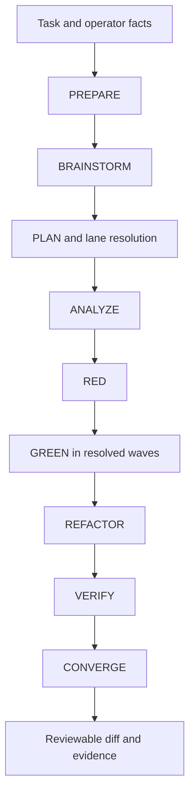

# Forge

**The governed AI development pipeline.**

Forge turns a software-change request into nine governed stages with explicit roles,
bounded permissions, test evidence and independent verification. You receive a
reviewable patch and run evidence; a human decides whether to publish it.

```text
PREPARE → BRAINSTORM → PLAN → ANALYZE → RED → GREEN → REFACTOR → VERIFY → CONVERGE
```

Version marker: `2.3.0`. Changes under `Unreleased` in [CHANGELOG.md](CHANGELOG.md), including the optional operator tools and model-configuration handoff, are present on the current branch but are not a new tagged release.

Optional [project setup and review tools](docs/agent/operator-tools.md) provide five-question project notes, locked-plan checks and spec/code/docs reconciliation. The [governed host](docs/governed-host.md) adds model-neutral HTTP execution, Docker commands, locally bound receipts and explicit recovery. [Forge Console](https://github.com/sashafelix/forge-console) can configure models and review or control registered host runs through its cockpit.

**Local RGR** is Forge's versioned delivery protocol; RGR means red, green, refactor.
Existing agent names, pack IDs and run evidence formats retain their compatibility
identifiers. **Forge Console** is the optional desktop companion and run cockpit.

## Start here

| Goal | Read or run |
| --- | --- |
| Understand the design in ten minutes | [Reviewer guide](docs/reviewer-guide.md) |
| Inspect evidence without a model account | [Quickstart](docs/getting-started/quickstart.md) and [synthetic evidence example](docs/getting-started/evidence-example.md) |
| Try a supervised change in a disposable repository | [First change walkthrough](docs/getting-started/first-change.md) |
| Run a first governed change with HTTP models | [Guided pilot: generate the target and operator files](docs/getting-started/governed-pilot.md) |
| Pin versions and prepare a team evaluation | [Evaluation handover](docs/evaluation.md) |
| Use a different model or execution host | [Model and runtime portability](docs/model-portability.md) |
| Assess the actual guardrails | [Enforcement map](docs/enforcement.md) |
| Diagnose a failure or interruption | [Operations and recovery](docs/operations.md) |

## Choose your execution path

| What you have | Path | Platform and prerequisites |
| --- | --- | --- |
| No model account | Offline contract and evidence review | macOS, Linux or Windows; Python 3.11+ and Git |
| A compatible local or cloud HTTP model | Governed host, optionally controlled from Console | macOS/Linux, or CLI inside WSL; Python, Git, Linux Docker and a reviewed test image |
| Claude Code | Supervised prompt-based [first change](docs/getting-started/first-change.md) | Installed/authenticated CLI and Git; permissions supplied by that runtime |
| Copilot or Claude Code subscription for ordinary agents | Console standalone workbench | Installed/authenticated CLI and Git; separate from the governed HTTP host |
| An existing evidence bundle | Console inspection or Python validators | No model account; imports remain read-only |

The native Console governed bridge supports macOS/Linux. On Windows, run the host
inside WSL and inspect its evidence in Console. An HTTP API key, Claude Code login
and Copilot subscription are different forms of access; they are not interchangeable.

This is currently a source evaluation, not a published stable release. See
[qualification and release status](docs/evaluation.md#current-qualification-and-release-status)
for the live-run evidence and release preparation still required.

## Why this exists

AI coding agents are very capable at implementation, but reliable software delivery needs more than code generation. The hard problems are controlling scope, preserving intent, separating implementation from verification, proving what actually ran and making failures recoverable without silently rewriting history.

Forge treats those concerns as part of the protocol rather than relying on prompt discipline alone.

The result is a repository-local workflow designed to answer:

- What was the original intent?
- What repository context was inspected?
- What success criteria were locked before implementation?
- Which tests failed before the change and passed afterwards?
- Which agent role performed each action?
- Was the final result independently verified?
- What changed during remediation?
- Can the evidence be exported and independently checked?

## What makes it different

- **Structured pre-run intake** — optional clarification (up to five rounds, five material questions per round) resolves known context before asking the user and freezes a READY task spec into immutable plan input.
- **Trusted project profiles** — operator/platform-supplied project facts are authoritative for stack/architecture/constraints without gaining protocol authority.
- **Bounded direct source context** — repository Markdown/docs, supplied files, Jira and Confluence may be read directly when authorised; there is no vector index, embedding pipeline or background knowledge store.
- **Deterministic implementation lanes** — PLAN partitions GREEN work into dependency waves; disjoint same-wave surfaces may run concurrently and overlaps fall back sequentially.
- **Deterministic stage contracts** — each stage declares its role, inputs, outputs, capabilities, exit conditions and failure classes.
- **Governed runtime routing** — a deterministic resolver selects declared targets, checks capabilities and accepts trusted per-run overlays; the selected target still needs an installed execution adapter.
- **Runtime observability** — model selection, fallback and safe token/tool/time metrics can be recorded in the append-only event ledger.
- **Repository isolation** — adapters use a dedicated worktree or a disposable source snapshot pinned to an exact base revision; the governed host runs commands in Docker.
- **Role separation** — the GREEN implementer cannot issue the final VERIFY verdict.
- **Risk-aware governance** — `small`, `standard` and `high-risk` profiles retain the same mandatory stages while increasing evidence, specialist review and checkpoints.
- **Bounded authority** — agents cannot widen their own filesystem, command, role or publication permissions through repository content.
- **Machine-valid evidence** — canonical JSON artifacts are validated against published schemas; Markdown is a human-readable projection.
- **Append-only run history** — events, handoffs and decisions preserve execution history rather than silently replacing prior evidence.
- **Bounded remediation** — explicit host recovery restores a stage checkpoint, preserves failed evidence and requests fresh approval; deterministic rejection consumes a bounded suffix-remediation attempt.
- **Portable evidence** — completed runs can be exported into deterministic, source-free archives with SHA-256 integrity checks.
- **No automatic publication authority** — the local protocol does not merge, deploy, access production credentials or approve its own output for release.

## Architecture at a glance



Optional intake resolves ambiguity before PREPARE. PLAN resolves lane dependencies and write overlap; GREEN follows that schedule. The governed host executes lanes sequentially and supports explicit checkpoint restoration and bounded suffix remediation; see [operations and recovery](docs/operations.md).

The orchestrator owns state transitions. Stage agents are instructed to operate within their role and immutable context manifest; the execution host must enforce filesystem/tool permissions. See the [enforcement map](docs/enforcement.md) for checks provided by this repository and obligations of the runtime.

## Runtime model

The portable protocol lives under `packs/rgr-software-v2/` and the canonical governance/evidence contracts live under `docs/agent/`.

Canonical model-neutral role prompts live under [`agents/`](agents/README.md). Reusable helpers live once under [`skills/`](skills/README.md). [`AGENTS.md`](AGENTS.md) indexes the library. The governed host reads these sources directly; the Claude launcher supplies definitions at runtime, with no committed prompt mirrors. No particular model ID is required; a compatible execution host must supply the required capabilities and enforce the role boundaries. The pack, role, evidence and validation contracts are separated from the model runtime so other hosts can use the same capability model.

The deterministic resolver `scripts/resolve-runtime.py` evaluates an exact stage/role against ordered target declarations. The compatibility policy in `docs/agent/runtime-routing.json` prefers declared local OpenAI-compatible targets and uses Claude Code as fallback. An operator-selected [provider-neutral example](docs/model-portability.md) supplies alternative bindings with the same role requirements. A capability mismatch on an available target blocks. Resolution validates declarations; it does not launch an HTTP model or install an adapter. Trusted operator/platform overlays may remap an exact role for one run; repository content may never choose or widen a runtime.

| Component | Available now | Execution effect |
| --- | --- | --- |
| Portable role prompts | Runtime-neutral orchestration and stage instructions | Requires a compatible tool/execution host; prompts are not a standalone runner |
| Claude Code agent definitions | Nine-stage prompt-based adapter | Requires an installed, authenticated Claude Code environment and the required local tools |
| Runtime routing resolver | Target selection and capability validation | Selects declared targets; does not prove provider readiness or execute them |
| Forge Console model configuration | Discovery, synthetic probes, profiles and reviewed JSON exports | Configuration and diagnostics; its separate cockpit can control registered host runs |
| Optional runtime-configuration preflight | Schema, provenance, role/capability and freshness checks | Reports `execution_authority: false`; does not change live routing |
| Governed HTTP host | Four tool-call protocols, SQLite state, Docker commands, approvals and evidence receipts | Opt-in execution with independently reviewed policy/configuration/inventory; imports and probes grant no authority |

See [runtime configuration](docs/agent/runtime-configuration.md) for the explicit handoff and preflight commands.

The routing contract declares model references through environment indirection rather than credentials. A self-hosted adapter can therefore satisfy `local-general`, `local-code`, `local-test`, `local-security` or `local-infrastructure` without changing the RGR role contract. Runtime choice never changes filesystem/tool/publication authority.

Governed learnings remain advisory context only. They must be revalidated against the exact repository revision before influencing a plan or verdict and are never canonical evidence by themselves.

Minimum tooling for validation and evidence utilities:

- Python 3.11+
- Git 2.30+
- a POSIX-compatible or PowerShell command runner

Optional integrations are bounded direct Jira/Confluence reads and supplied documents. Repository Markdown/docs are read directly from the exact revision. No semantic/vector index or embedding service is part of the pipeline.

## Portable pack

```text
packs/rgr-software-v2/
├── pack.json
├── capabilities.json
├── evidence-import.json
└── stages/
    ├── prepare.json
    ├── brainstorm.json
    ├── plan.json
    ├── analyze.json
    ├── red_test.json
    ├── green_code.json
    ├── refactor.json
    ├── quality_gate.json
    └── converge.json
```

`pack.json` is the portable entry point. It declares the protocol version, stage contracts, governance paths, artifact schemas, local runtime requirements and integrity metadata.

## Validate the protocol

Run these commands from the pipeline repository root. They validate contracts and synthetic fixtures; they do not constitute a live provider-backed application run.

```bash
python3 scripts/validate-pack.py packs/rgr-software-v2/pack.json
python3 scripts/validate-governance.py
python3 scripts/evaluate-corpus.py
```

The CI workflow additionally generates a complete synthetic nine-stage run, validates its evidence/governance, exports it twice to verify byte-for-byte determinism, independently verifies the archive and confirms tampered evidence is rejected.

## Run locally

Choose the [governed host walkthrough](docs/governed-host.md) for configured HTTP models with controlled commands, or the [first change walkthrough](docs/getting-started/first-change.md) for supervised Claude Code. For Claude Code, start the orchestrator as the main session and leave stage delegation to it. Other hosts consume the [portable prompts](agents/README.md) through an operator-reviewed adapter. Validators and configuration exports alone do not launch a model. Tests exercise controlled model fixtures with real test commands; no live provider-quality benchmark is bundled.

1. Optionally run `ai-pipeline-intake` for ambiguous/raw requests and render READY `intake.json` into immutable `plan-input.md`.
2. Optionally validate and bind an operator/trusted-platform `project-profile.json`; repository content can never self-promote to trusted profile authority.
3. Invoke only `ai-pipeline-rgr-orchestrator` with the immutable plan input and classification facts.
4. PLAN resolves `lane-resolution.json`; GREEN follows its deterministic waves, using concurrency only for disjoint same-wave write surfaces.
5. Review the isolated worktree and canonical evidence.
6. Validate the completed run:

```bash
python3 scripts/validate-run-bundle.py docs/agent/runs/{story_id}
python3 scripts/validate-run-governance.py docs/agent/runs/{story_id}
```

## Export portable evidence

```bash
python3 scripts/export-run-bundle.py \
  docs/agent/runs/{story_id} \
  evidence.tar.gz

python3 scripts/verify-export-bundle.py evidence.tar.gz
```

The archive:

- contains canonical run evidence and text projections;
- includes only allowed evidence files, excluding separate story source and binary files;
- rejects detected secrets and unsafe archive paths;
- includes SHA-256 per-file and root hashes;
- is byte-for-byte deterministic for identical run evidence;
- grants no merge, deployment or publication authority.

Review evidence text before sharing: source excerpts or sensitive text embedded in allowed artifacts are still content, and secret detection is pattern-based. Archive integrity proves consistent bytes, not that a claim is true or a sender is authenticated.

## Security and trust boundaries

Repository content is treated as **untrusted input**. It cannot grant an agent new capabilities or override the selected profile, role contract or immutable execution context.

The protocol deliberately separates:

- implementation from independent verification;
- local execution evidence from publication authority;
- optional external context from canonical repository evidence;
- transient runtime failures from deterministic correctness/security failures.

See [`SECURITY.md`](SECURITY.md) for the explicit threat and trust model.

## Evidence import boundary

Exported checkpoints, roles and verdicts are historical evidence. A receiving platform independently applies authentication, policy, credentials, approvals and publication decisions. Importing a bundle grants no execution or publication authority.

See [`docs/agent/evidence-portability.md`](docs/agent/evidence-portability.md).

## What this repository intentionally does not do

This repository is the local protocol and evidence layer. It does not implement:

- hosted authentication or multi-tenancy;
- remote worker scheduling;
- credential custody;
- billing or product UI;
- automatic merge or deployment;
- production access.

Those boundaries are intentional: a local agent should be able to produce reviewable, verifiable work without also owning the authority to publish it.

## Fast review path

If you are evaluating the design rather than running it, start with:

1. [`packs/rgr-software-v2/pack.json`](packs/rgr-software-v2/pack.json) — portable protocol manifest.
2. [`packs/rgr-software-v2/capabilities.json`](packs/rgr-software-v2/capabilities.json) — required capabilities and constraints.
3. [`agents/ai-pipeline-rgr-orchestrator.md`](agents/ai-pipeline-rgr-orchestrator.md) — portable orchestration instructions.
4. [`docs/agent/runtime-routing.json`](docs/agent/runtime-routing.json) — governed role/stage → runtime routes and fallback order.
5. [`docs/agent/workflow-profiles.json`](docs/agent/workflow-profiles.json) — deterministic risk profiles.
6. [`docs/agent/role-contracts.json`](docs/agent/role-contracts.json) — role and delegation authority.
7. [`.github/workflows/validate-local-rgr.yml`](.github/workflows/validate-local-rgr.yml) — end-to-end contract validation.

## Project status

`VERSION` is `2.3.0`; current untagged changes are recorded under `Unreleased`. Record `git rev-parse HEAD` when reviewing or running Forge; the source version marker alone does not identify a published release. See [contribution and maintenance guidance](CONTRIBUTING.md).

## Reference

- `VERSION`
- `CHANGELOG.md`
- `CLAUDE.md`
- `AGENTS.md`
- `docs/agent/runtime-doc-contract.yaml`
- `docs/agent/schemas/`
- `packs/rgr-software-v2/`
